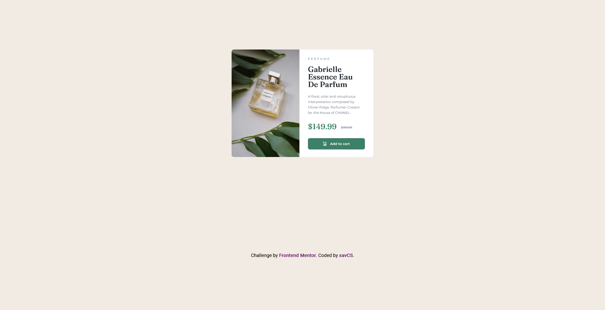
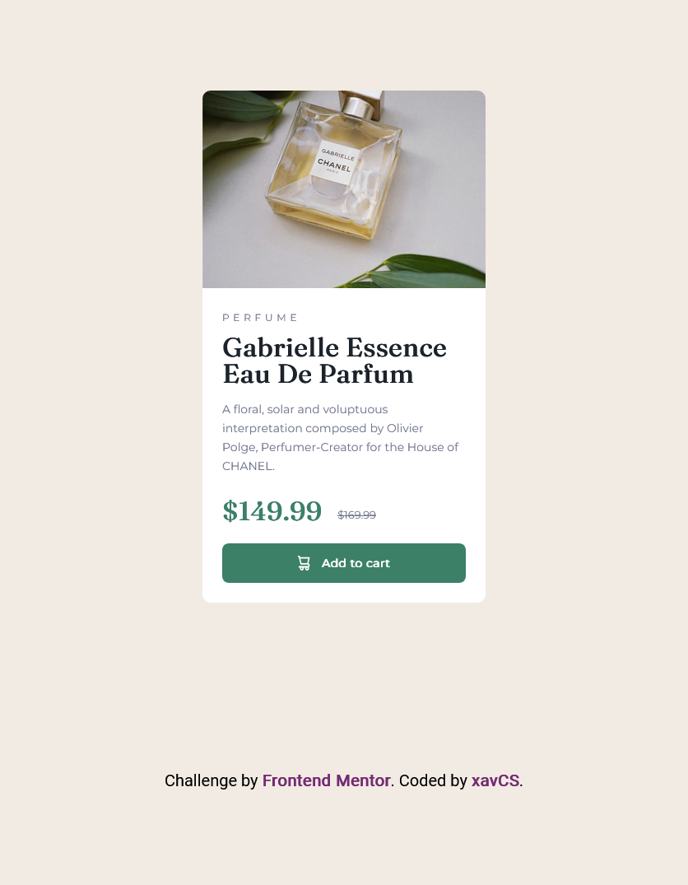

# Frontend Mentor - Product preview card component solution

This is a solution to the Product preview card component challenge on Frontend Mentor:
  https://www.frontendmentor.io/challenges/product-preview-card-component-GO7UmttRfa  

### Screenshot




Add a screenshot of your solution. The easiest way to do this is to use Firefox to view your project, right-click the page and select "Take a Screenshot". You can choose either a full-height screenshot or a cropped one based on how long the page is. If it's very long, it might be best to crop it.

Alternatively, you can use a tool like [FireShot](https://getfireshot.com/) to take the screenshot. FireShot has a free option, so you don't need to purchase it. 

Then crop/optimize/edit your image however you like, add it to your project, and update the file path in the image above.

**Note: Delete this note and the paragraphs above when you add your screenshot. If you prefer not to add a screenshot, feel free to remove this entire section.**

### Links

- Solution URL: [Add solution URL here](https://your-solution-url.com)
- Live Site URL: [Add live site URL here](https://your-live-site-url.com)


From this project I mainly refined what I already knew of flexbox (which is not much) including things like flex-direction and improved on my ability to make responsive designs using media queries. 
I also learned about the ```<picture></picture>``` element and how I can use it to make responsive images that dynamically load in based on viewports which is nice as I was getting confused using the `````` method.

I would like to tackle some more projects that require responsiveness so that I can learn a lot more about positioning and display styles. I don't yet feel fully confident with things like grid or flex and I still find positioning in general to be a challenge.


For anyone trying to learn about key/fundamental concepts in CSS and HTML or even JS I would highly recommend the MDN documentation and especially their front-end development course which is completely free.

